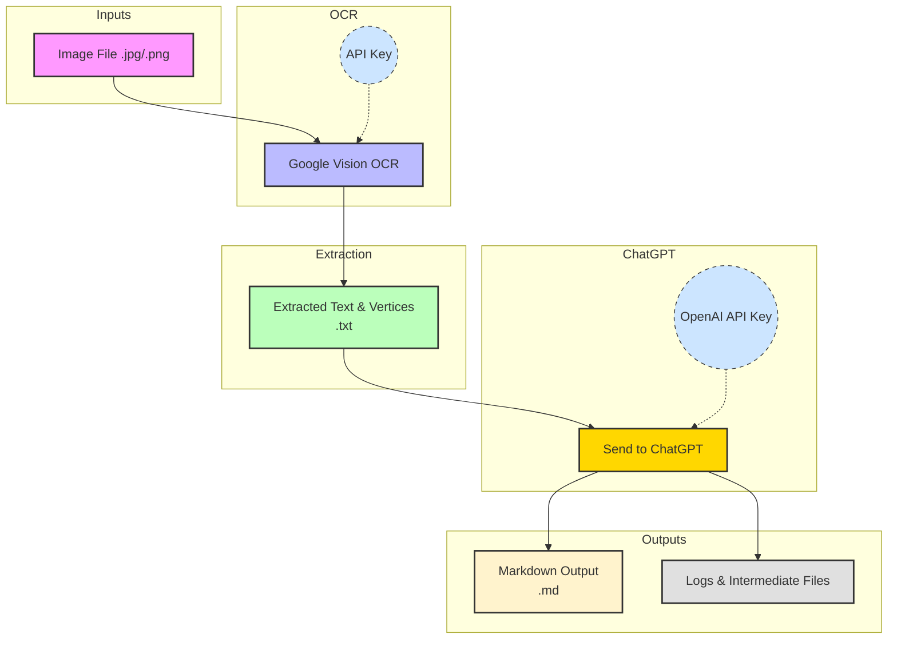

# Image to OCR with Vertices to ChatGPT to Markdown Process

This notebook demonstrates a workflow for converting images (such as scanned pages from a PDF) into structured markdown using OCR and ChatGPT. The process leverages Google Cloud Vision for OCR, extracts text and bounding box vertices, and then uses OpenAI's GPT model to format the extracted text into markdown tables or structured content.

## Workflow Overview

1. **Image Selection**
   - The user selects a directory containing image files (e.g., `.jpg`, `.png`).
   - Images are sorted numerically for consistent processing order.

2. **Google Cloud Vision OCR**
   - For each image, the `extract_text_with_google_vision` function is called.
   - This function uses Google Cloud Vision to extract both the text and the bounding box vertices for each detected text element.
   - The extracted text and vertices are saved to files for reference and reproducibility.

3. **(Optional) Text Preprocessing**
   - The raw OCR text can be preprocessed to clean up unwanted strings or group lines logically (see `preprocess_text`).

4. **Sending to ChatGPT for Markdown Conversion**
   - The extracted OCR text and the vertices list are sent to ChatGPT using the `convert_ocr_text_and_vertices_to_markdown` function.
   - The prompt instructs ChatGPT to:
     - Arrange the OCR text into markdown, preserving tables and structure.
     - Use the vertices list only to understand the structure, not to extract new information.
     - Avoid hallucinating or guessing missing data.
     - Preserve blank or empty cells in tables.
   - The markdown output is saved to a file.

5. **Logging and Output**
   - All steps, including prompts and outputs, are logged for traceability.
   - The final markdown files can be used for further analysis or documentation.

## Token Efficiency with Vertices Approach

By extracting both the OCR text and the vertices (bounding box coordinates) from the image, and sending only this structured information to ChatGPT, the workflow becomes significantly more token efficient compared to sending the entire image or large unstructured data blobs. 
This approach allows for batch processing of many images without exceeding token or context window limits, making it suitable for large-scale document digitization.

## Google Cloud Vision API Free Tier and Token Usage

Google Cloud Vision API offers new users \$300 in free credits, which can be used across all Google Cloud services, including Vision OCR. The OCR process appears to use no tokens with Google Cloud Vision.  Compared to GPT-4.1, which costs approximately $0.02 per image input, from our testing.  

## Process Overview (Mermaid Diagram)

## Key Functions

- `extract_text_with_google_vision(image_path)`: Extracts text and bounding box vertices from an image using Google Cloud Vision.
- `convert_ocr_text_and_vertices_to_markdown(ocr_text, vertices_list, client, log_dir)`: Sends OCR text and vertices to ChatGPT for markdown conversion.
- `save_markdown(markdown_text, output_path)`: Saves the markdown output to a file.

## Example Use Case

This workflow is ideal for digitizing tabular data from scanned construction cost books, invoices, or any structured documents where table structure is important and must be preserved in markdown format.

---

**Note:**
- The process requires valid API keys for both OpenAI and Google Cloud Vision.
- The workflow is interactive and uses Tkinter dialogs for user input.
- All intermediate and final outputs are saved for transparency and reproducibility.
