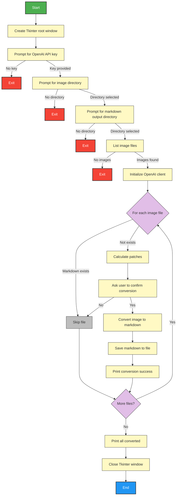
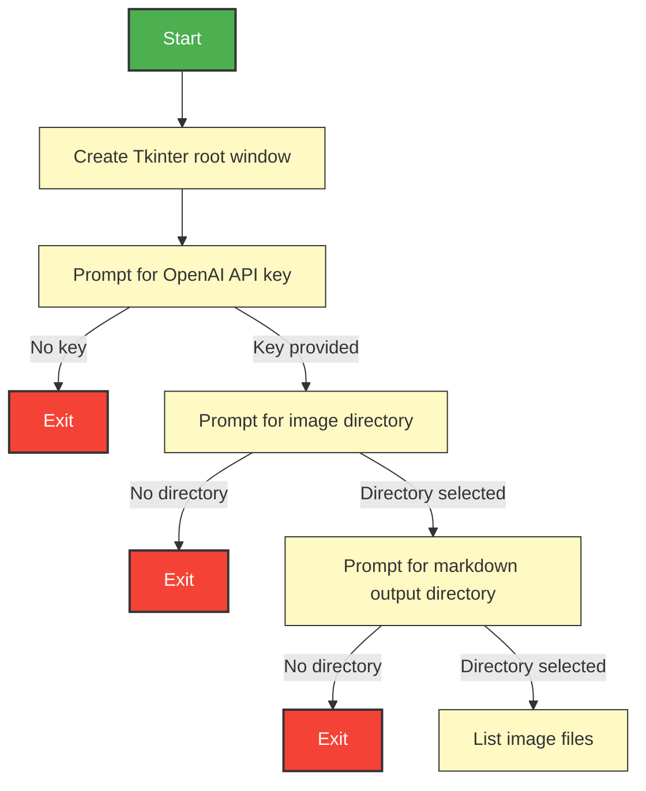
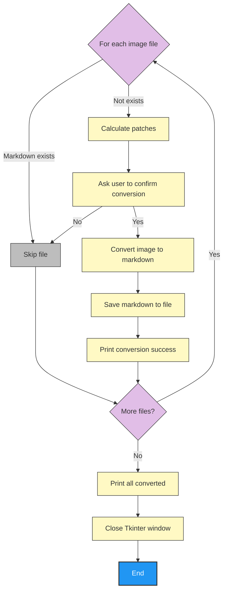

START
|
|-- Create Tkinter root window
|-- Prompt user for OpenAI API key
|   |-- If not provided, EXIT
|
|-- Prompt user to select image directory
|   |-- If not provided, EXIT
|
|-- Prompt user to select markdown output directory
|   |-- If not provided, EXIT
|
|-- List image files in directory
|   |-- If none, EXIT
|
|-- Initialize OpenAI client
|
|-- FOR each image file:
|     |-- Check if markdown file exists
|     |   |-- If yes, SKIP
|     |
|     |-- Calculate number of patches in image
|     |-- Ask user to confirm conversion
|     |   |-- If no, SKIP
|     |
|     |-- Convert image to markdown via OpenAI API
|     |-- Save markdown to file
|     |-- Print conversion success
|
|-- Print "All images converted"
|-- Close Tkinter window
END

### Partial Diagram: Get User Input and Initialize OpenAI Client

### Partial Diagram: Process Each Image File

